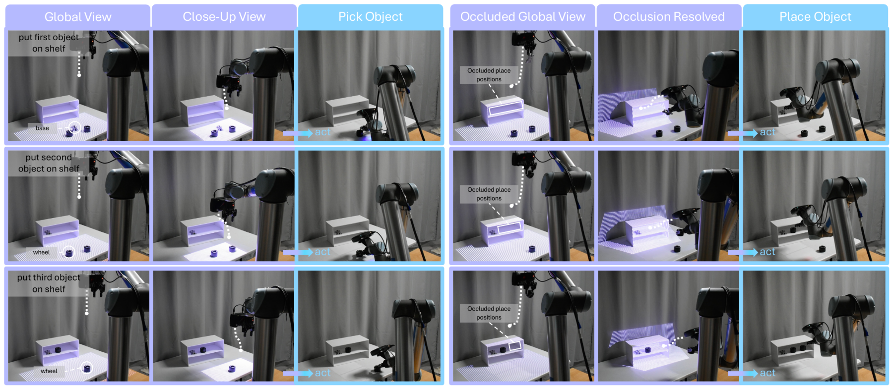
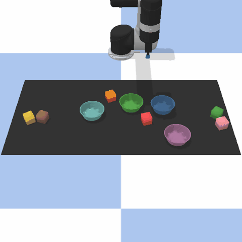
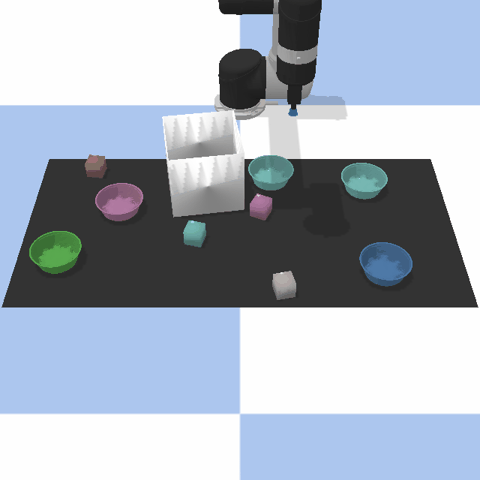
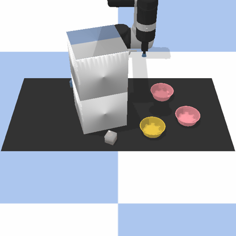
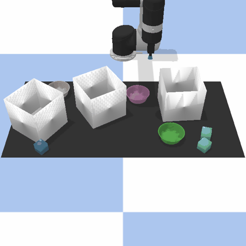

<h1 align="center">Learning to See While Learning to Act:<br>Diffusion Models for Active Perception in Robot Imitation</h1>

<p align="center">Kuancheng Wang, Vaibhav Saxena, Shuo Cheng, Yotto Koga, Danfei Xu</p>

<p align="center">
  <a href="https://arxiv.org/abs/2606.23625"></a>
  &nbsp;
  <a href="https://see2act.github.io"></a>
  &nbsp;
  <a href="https://huggingface.co/harrywang01/See2Act"></a>
  &nbsp;
  <a href="https://huggingface.co/datasets/harrywang01/See2Act"></a>
</p>

<p align="center"></p>

See2Act is a diffusion policy that refines *where to look* together with *what to do*. Every denoising step
moves the camera to a pose computed from the current action estimate, renders the scene from there, and
conditions the next step on that view, so the policy recovers even when the target is hidden from the initial
view. This repository contains the method and the four occluded Ravens tasks of the paper: simulator,
demonstration collection, training and evaluation.

## 🛠️ Installation

Tested on Ubuntu with Python 3.9, PyTorch 2.1.1 (CUDA 12.1), PyBullet 3.2.6 and NVIDIA GPUs. Rendering uses
PyBullet's EGL plugin (headless OpenGL on Linux).

```bash
git clone https://github.com/KuanchengWang/see2act.git
cd see2act
```

**With `uv`** (recommended, creates `.venv` with Python 3.9):

```bash
bash setup_env.sh                 # TORCH_INDEX=https://download.pytorch.org/whl/cu118 for CUDA 11.8
source .venv/bin/activate
```

**With pip / conda:**

```bash
conda create -n see2act python=3.9 -y && conda activate see2act
pip install torch==2.1.1 torchvision==0.16.1 --index-url https://download.pytorch.org/whl/cu121
pip install -e .
```

## 📥 Checkpoints and datasets

The trained policies and the demonstration datasets of the paper are on the Hugging Face Hub
([checkpoints](https://huggingface.co/harrywang01/See2Act), [datasets](https://huggingface.co/datasets/harrywang01/See2Act)):

```bash
hf download harrywang01/See2Act --local-dir checkpoints                    # see2act_<task>.pth, 274 MB each
hf download harrywang01/See2Act --repo-type dataset --local-dir data       # <task>.hdf5, 100 train + 20 validation demos each
```

| checkpoint | inference protocol stored in the checkpoint |
|---|---|
| `checkpoints/see2act_place-red-in-green.pth` | 1 refinement run, T = 50 |
| `checkpoints/see2act_bin-picking.pth` | 1 refinement run, T = 50 |
| `checkpoints/see2act_put-within-shelf.pth` | 1 refinement run, T = 50 |
| `checkpoints/see2act_bin-search.pth` | 10 refinement runs, `final_action_variance` selection, T = 20 |

Every checkpoint carries its configuration, so `evaluate.py` and `visualize_episode.py` need no extra flags.

## 🎯 Tasks

Four pick-and-place tasks (red block into the green bowl) for a UR5 with a suction gripper in PyBullet. The
policy starts from a fixed front view; in three of the tasks the block is hidden from it. An episode succeeds
when the block ends up inside the bowl.

<table align="center">
  <tr>
    <td align="center" width="50%"><br><b>place-red-in-green</b><br>block and bowl among eight distractors; target visible</td>
    <td align="center" width="50%"><br><b>bin-picking</b><br>the block sits inside a bin lying on its side; target hidden</td>
  </tr>
  <tr>
    <td align="center" width="50%"><br><b>put-within-shelf</b><br>block on the top level, bowl on the bottom level of a shelf; both hidden</td>
    <td align="center" width="50%"><br><b>bin-search</b><br>three bins, the block is inside one of them; target hidden</td>
  </tr>
</table>

## 📦 Collecting demonstrations

```bash
python scripts/collect_demos.py --task bin-picking --n_train 100 --n_valid 20 --out data/bin-picking.hdf5
```

This is how the released datasets were produced. The scripted expert writes 100 training and 20 validation
demonstrations (even and odd seeds; failed demonstrations are skipped). Each demonstration stores the keyframe action (pick pose, place pose), the scene
(all object poses) and two reference images. The policy never reads the stored images: during training and
inference the renderer rebuilds the scene in PyBullet and renders whatever view the camera schedule asks for.
One task takes about three minutes. Replay a demonstration with

```bash
python scripts/render_demo.py --dataset data/bin-picking.hdf5 --demo demo_0 --out media/bin-picking.mp4
```

## 🚀 Training

```bash
python scripts/train.py --config configs/see2act.json --dataset data/bin-picking.hdf5 --name see2act_bin-picking
```

* `configs/see2act.json` is the paper's configuration: 30k epochs (one epoch is one pass over the 100
  demonstrations), about 11 h on one RTX A6000 with 14 render workers. Two runs fit on one GPU.
* Outputs go to `runs/<name>/<timestamp>/`: `config.json`, `log.txt`, `metrics.jsonl`, TensorBoard logs
  (`tensorboard --logdir runs`) and `checkpoints/` with a checkpoint every 2000 epochs, the best-validation
  checkpoint and `last.pth`.
* Override any hyper-parameter with `--set key=value` (e.g. `--set train.num_epochs=10000`); the defaults are
  listed in `see2act/config.py`. Resume with `--resume <run>/checkpoints/last.pth`.
* Pin a run and its render workers to one GPU with `CUDA_VISIBLE_DEVICES` and `EGL_VISIBLE_DEVICES`.

## 🎥 Rollout

```bash
# 50 seeded episodes with the checkpoint's own protocol (released checkpoints: see above)
python scripts/evaluate.py --checkpoint checkpoints/see2act_bin-picking.pth --n_episodes 50 --run_name single
# multi-rollout inference: 10 runs per keyframe, keep the most stable one
python scripts/evaluate.py --checkpoint <ckpt.pth> --n_episodes 50 --n_rollout 10 --select_by final_action_variance --run_name nr10
# every checkpoint of a training run
python scripts/sweep_checkpoints.py --run_dir runs/see2act_bin-picking/<timestamp> --protocol single
# the views chosen in one episode: image grid, GIF and a video of the execution
python scripts/visualize_episode.py --checkpoint checkpoints/see2act_bin-search.pth --seed 200001 --out viz/views.png --gif viz/views.gif --video viz/rollout.mp4
```

* Episodes use the seeds 200001, 200003, ... (`--seed_start`); the scene and all noise derive from the seed and
  CUDA kernels run deterministically, so repeated evaluations are identical.
* `results/<task>/<run_name>/` holds one JSON per episode (executed and expert actions, failure category,
  camera trajectory, per-step action estimates) and `summary.json` with the success rate and its 95%
  confidence interval. An interrupted evaluation resumes from the episodes already on disk.
* `--num_steps` changes the number of refinement steps at inference; `--select_by` chooses the multi-rollout
  criterion (`final_action_variance`, `final_camera_variance`, `camera_variance`, `action_variance`,
  `action_entropy`).
* `bash scripts/reproduce.sh [task ...]` runs the whole pipeline: demonstrations, training and a checkpoint sweep.

## 🔧 Troubleshooting

* **Rendering fails at start-up.** Install the NVIDIA EGL libraries (`libEGL`, `libGL`), or set
  `SEE2ACT_USE_EGL=0` to fall back to PyBullet's CPU renderer (much slower; images differ slightly from the
  EGL ones, so train and evaluate with the same renderer). On multi-GPU machines set `EGL_VISIBLE_DEVICES`.
* **Memory.** Each render worker holds a PyBullet client and an EGL context (about 300 MB of GPU memory and
  1 GB of RAM); reduce `--renderer_workers` on small machines. Evaluation needs a single worker.

## 📄 License and acknowledgements

The code is released under the MIT License (see `LICENSE`). The simulator under `see2act/sim` and its assets
are adapted from [Ravens](https://github.com/google-research/ravens) (Apache 2.0); the UR5 model is from ROS
Industrial / Virtana (Apache 2.0); the training and encoder code was originally developed on top of
[robomimic](https://github.com/ARISE-Initiative/robomimic) (MIT). See `NOTICE` for details.

## 📚 Citation

```bibtex
@misc{wang2026learninglearningactdiffusion,
      title={Learning to See While Learning to Act: Diffusion Models for Active Perception in Robot Imitation}, 
      author={Kuancheng Wang and Vaibhav Saxena and Shuo Cheng and Yotto Koga and Danfei Xu},
      year={2026},
      eprint={2606.23625},
      archivePrefix={arXiv},
      primaryClass={cs.RO},
      url={https://arxiv.org/abs/2606.23625}, 
}
```
